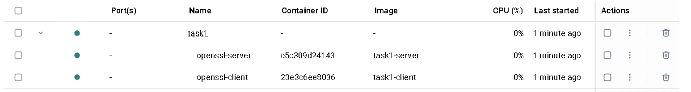

# Lab #2,21110775, Duong Duc Khai, INSE331280E_02FIE
# Task 1: Public-key based authentication
**Question 1**: Implement public-key based authentication step-by-step with openssl according the following scheme. <br>
**Answer 1**:
## 1. Create a docker image to set up containers:
*First, we create a docker file for a container:*<br>
```sh
FROM ubuntu:20.04

RUN apt-get update && apt-get install -y openssl vim && rm -rf /var/lib/apt/lists/*

WORKDIR /app
CMD ["/bin/bash"]
```

The container will be running on ubuntu:20.04 with openssl and vim preinstalled.

## 2. Create a compose to build the client and server:
*We write a compose file that build the client and server images, and start them:*<br>

```sh
version: '3.8'

services:
  server:
    build:
      context: ./
    container_name: openssl-server
    volumes:
      - ./server/data:/app/data
    networks:
      - openssl-network
    tty: true

  client:
    build:
      context: ./
    container_name: openssl-client
    volumes:
      - ./client/data:/app/data
    depends_on:
      - server
    networks:
      - openssl-network
    tty: true

networks:
  openssl-network:
    driver: bridge
```

Using the previous Dockerfile to create 2 service: cilent and server. These 2 services can talk through the bridge network.

## 3. Build the image and start the services:
*We run this command to build and start the Docker services:*<br>

```sh
docker compose up --build
```

<br>

## 4. Creating the challenge message
*On the server's terminal, we run:*<br>

```sh
echo "This is a message from server" > /app/data/challenge.txt
```

A text file name challenge.txt with the content "This is a message from server" is created on the server container.

## 5. Generate client's key pair
*On the client's terminal, we run:*<br>

```sh
openssl genrsa -out /app/data/client_private.pem 2048
openssl rsa -in /app/data/client_private.pem -pubout -out /app data/client_public.pem
```

The first command generate a RSA private key.
The second command derive a public from the generated private key.

<br>

## 6. Client initiates the connection & send public key to the server
*In a traditional public key authentication flow, the client would initiate an ssh connection and send the public key to the server. Here, to simplify the problem, we'll copy the public key from the client to the server's volume:*<br>

<br>

## 7. Server encrype the challenge message using the received public key
*On the server's terminal, we run:*<br>

```sh
openssl rsautl -encrypt -inkey /app/data/client_public.pem -pubin -in /app/data/challenge.txt -out /app/data/challenge_encrypted.bin
```
<br>

## 8. Server sends the encrypted challenge message to the client
*To replicate this, we copy the encrypted challenge message from the server to the client*<br>

<br>

## 9. Client decrypts the message using the private key
*On the client's terminal, we run:*<br>

```sh
openssl rsautl -decrypt -inkey /app/data/client_private.pem -in /app/data/challenge_encrypted.bin -out /app/data/challenge_decrypted.txt
```

<br>

## 10. Client signs the decrypted message
*On the client's terminal, we run:*<br>

```sh
openssl dgst -sha256 -sign /app/data/client_private.pem -out /app/data/challenge_signature.bin /app/data/challenge_decrypted.txt
```

<br>

## 11. Client sends the signed message back to the server
*To replicate this, we copy the signed challenge message from the client to the server*<br>

<br>

## 12. Server verifies the signed message using the client's public key
*On the server's terminal, we run:*<br>

```sh
openssl dgst -sha256 -verify /app/data/client_public.pem -signature /app/data/challenge_signature.bin /app/data/challenge.txt
```

<br>

We've completed the public-key based authentication flow.


