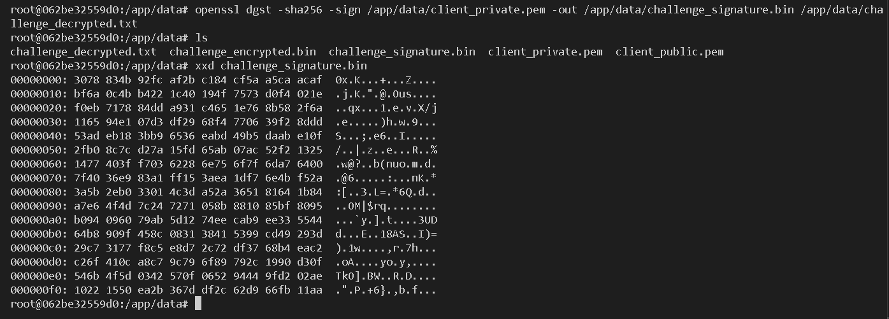
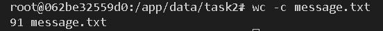
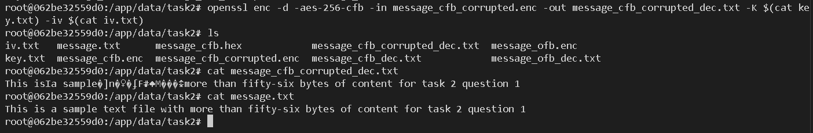
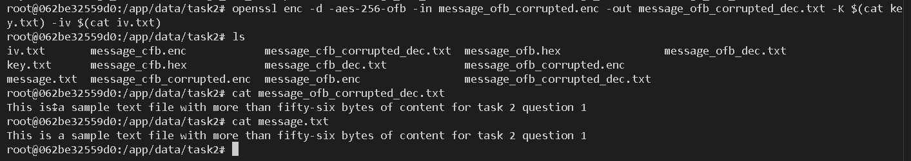

# Lab #2,21110775, Duong Duc Khai, INSE331280E_02FIE
# Task 1: Public-key based authentication
**Question 1**: Implement public-key based authentication step-by-step with openssl according the following scheme. <br>
**Answer 1**:
## 1. Create a docker image to set up containers:
*First, we create a docker file for a container:*<br>
```sh
FROM ubuntu:20.04

RUN apt-get update && apt-get install -y openssl vim && rm -rf /var/lib/apt/lists/*

WORKDIR /app
CMD ["/bin/bash"]
```

The container will be running on ubuntu:20.04 with openssl and vim preinstalled.

## 2. Create a compose to build the client and server:
*We write a compose file that build the client and server images, and start them:*<br>

```sh
version: '3.8'

services:
  server:
    build:
      context: ./
    container_name: openssl-server
    volumes:
      - ./server/data:/app/data
    networks:
      - openssl-network
    tty: true

  client:
    build:
      context: ./
    container_name: openssl-client
    volumes:
      - ./client/data:/app/data
    depends_on:
      - server
    networks:
      - openssl-network
    tty: true

networks:
  openssl-network:
    driver: bridge
```

Using the previous Dockerfile to create 2 service: cilent and server. These 2 services can talk through the bridge network.

## 3. Build the image and start the services:
*We run this command to build and start the Docker services:*<br>

```sh
docker compose up --build
```

<br>

## 4. Creating the challenge message
*On the server's terminal, we run:*<br>

```sh
echo "This is a message from server" > /app/data/challenge.txt
```

A text file name challenge.txt with the content "This is a message from server" is created on the server container.

## 5. Generate client's key pair
*On the client's terminal, we run:*<br>

```sh
openssl genrsa -out /app/data/client_private.pem 2048
openssl rsa -in /app/data/client_private.pem -pubout -out /app data/client_public.pem
```

The first command generate a RSA private key.
The second command derive a public from the generated private key.

<br>

## 6. Client initiates the connection & send public key to the server
*In a traditional public key authentication flow, the client would initiate an ssh connection and send the public key to the server. Here, to simplify the problem, we'll copy the public key from the client to the server's volume:*<br>

<br>

## 7. Server encrype the challenge message using the received public key
*On the server's terminal, we run:*<br>

```sh
openssl rsautl -encrypt -inkey /app/data/client_public.pem -pubin -in /app/data/challenge.txt -out /app/data/challenge_encrypted.bin
```
<br>

## 8. Server sends the encrypted challenge message to the client
*To replicate this, we copy the encrypted challenge message from the server to the client*<br>

<br>

## 9. Client decrypts the message using the private key
*On the client's terminal, we run:*<br>

```sh
openssl rsautl -decrypt -inkey /app/data/client_private.pem -in /app/data/challenge_encrypted.bin -out /app/data/challenge_decrypted.txt
```

<br>

## 10. Client signs the decrypted message
*On the client's terminal, we run:*<br>

```sh
openssl dgst -sha256 -sign /app/data/client_private.pem -out /app/data/challenge_signature.bin /app/data/challenge_decrypted.txt
```

<br>

## 11. Client sends the signed message back to the server
*To replicate this, we copy the signed challenge message from the client to the server*<br>

<br>

## 12. Server verifies the signed message using the client's public key
*On the server's terminal, we run:*<br>

```sh
openssl dgst -sha256 -verify /app/data/client_public.pem -signature /app/data/challenge_signature.bin /app/data/challenge.txt
```

<br>

We've completed the public-key based authentication flow.

# Task 2: Encrypting large message 
Create a text file at least 56 bytes. <br>
**Question 1**:
Encrypt the file with aes-256 cipher in CFB and OFB modes. How do you evaluate both cipher as far as error propagation and adjacent plaintext blocks are concerned. <br>
**Answer 1**:
## 1. Create the message file
*We'll reuse the client container for this lab. First, we'll create a new folder and create the message with at least 56 bytes:*<br>

```sh
mkdir task2
cd task 2
echo "This is a sample text file with more than fifty-six bytes of content for task 2 question 1" > message.txt
```

<br>

We can verify the message size with the following command:

```sh
wc -c message.txt
```

<br>

## 2. Create a key and IV

```sh
openssl rand -hex 32 > key.txt
openssl rand -hex 16 > iv.txt
```

<br>

The first command creates a key text file that has 32 bytes - 256 bits.
The second command creates an IV text file that has 16 bytes - 128 bits.

## 3. Encrypt the file in CFB mode
*We'll encrypt the message using aes 256 in CFB mode with the generated key and iv:*<br>

```sh
openssl enc -aes-256-cfb -in message.txt -out message_cfb.enc -K $(cat key.txt) -iv $(cat iv.txt)
```

<br>

## 4. Decrypt the CFB encrypted message
*We run:*<br>
```sh
openssl enc -d -aes-256-cfb -in message_cfb.enc -out message_cfb_dec.txt -K $(cat key.txt) -iv $(cat iv.txt)
```

<br>

## 5. Encrypt the file in OFB mode
*We'll encrypt the message using aes 256 in OFB mode with the generated key and iv:*<br>

```sh
openssl enc -aes-256-ofb -in message.txt -out message_ofb.enc -K $(cat key.txt) -iv $(cat iv.txt)
```

<br>

## 6. Decrypt the OFB encrypted message
*We run:*<br>
```sh
openssl enc -d -aes-256-ofb -in message_ofb.enc -out message_ofb_dec.txt -K $(cat key.txt) -iv $(cat iv.txt)
```

<br>

## 7. Error propagation of both ciphers
*In CFB mode, an error in the ciphertext affects the current block and propagates into subsequent blocks during decryption. <br><br>
In OFB mode, an error in the ciphertext affects only the corresponding block during decryption.*<br><br>

**Question 2**:
Modify the 8th byte of encrypted file in both modes (this emulates corrupted ciphertext).
Decrypt corrupted file, watch the result and give your comment on Chaining dependencies and Error propagation criteria.<br>
**Answer 2**:
## 1. Corrupt the CFB Ciphertext
*We run:*<br>

```sh
xxd message_cfb.enc > message_cfb.hex
xxd -r message_cfb.hex > message_cfb_corrupted.enc
```

We use the first command to convert the file to heximal and the second command the convert it back after we have modified the 8th bit.

<br>
In the above pic, the 8th bit is 96. We modify it to ff.

## 2. Decrypt the Corrupted CFB File
*We run:*<br>

```sh
openssl enc -d -aes-256-cfb -in message_cfb_corrupted.enc -out message_cfb_corrupted_dec.txt -K $(cat key.txt) -iv $(cat iv.txt)
```

<br>
The above shows the decrypted corrupted file using cfb and the original message.

## 3. Corrupt the OFB Ciphertext
*We run:*<br>

```sh
xxd message_ofb.enc > message_ofb.hex
xxd -r message_ofb.hex > message_ofb_corrupted.enc
```

<br>
We repeat the step 1 but on the OFB file. Here we changed the 8th byte 96 to a1.

## 4. Decrypt the Corrupted OFB File
*We run:*<br>

```sh
openssl enc -d -aes-256-ofb -in message_ofb_corrupted.enc -out message_ofb_corrupted_dec.txt -K $(cat key.txt) -iv $(cat iv.txt)
```

<br>
The above shows the decrypted corrupted file using ofb and the original message.

## 5. Comments of CFB and OFB error propogation
In the cfb results: starting from the 8th byte, the errors appear and persist for about 16 characters. This is because CFB uses feedback chaining, where each cipher bock affects the next cipher block. This dependency causes the errors at one block to affect the next one. Because we use AES, each block has 16 bytes, the errors stop after 16 characters.<br><br>
In the ofb results: the error happens on the 8th byte only and the remaining text is decrypted normally. This is because ofb uses keystream independent of the plaintext. The keystream XORs
with the original plaintext so the corruption doesn't spread.